# 🏆 BÁO CÁO ĐIỀU PHỐI ĐỘI NGŨ 6 AGENT: SEA x OPENAI CODEX HACKATHON

> **Dự án**: COD-Shield: Autonomous Multimodal Evidence Forensics & 1-Click Dispute Settlement Agent  
> **Cuộc thi**: Sea x OpenAI Regional Codex Hackathon  
> **Quy trình chuẩn hóa**: [workflow.md](file:///Users/harryluong1203/Documents/Personal%20Project/SeaXOpenAI/workflow.md) (v2 - Đã vá 8 lỗ hổng)  
> **Trạng thái vòng lặp**: **ĐẠT (PASS)** tại Vòng lặp thứ 2  
> **Điểm Rubric Vòng 2 (Agent 3 - Stateless)**: **8.92 / 10.0** (Ngưỡng đạt: $\ge 8.0$)  

---

## 👥 Danh sách 6 Agent & Thiết lập hệ thống

| Agent | Định danh | Nhiệm vụ chính | Thiết lập chuyên biệt |
|---|---|---|---|
| **Agent 1** | `agent1_ideator` | Nhận đề bài hackathon, sinh ý tưởng giải pháp | Tiếp nhận lý do từ chối nếu bị Agent 2 phản hồi |
| **Agent 2** | `agent2_novelty_checker` | Thẩm định độc quyền & lọc trùng lặp | Chốt chặn kép: sau Agent 1 và tái kiểm sau Agent 6 |
| **Agent 3** | `agent3_rubric_evaluator` | Chấm điểm Rubric 4 tiêu chí | **Stateless 100%**: không biết số vòng, chống nương tay |
| **Agent 4** | `agent4_problem_analyzer` | Mổ xẻ nguyên nhân & tái cấu trúc | Nhận toàn bộ Payload History để không lặp lại sai lầm cũ |
| **Agent 5** | `agent5_solution_critic` | Phản biện giải pháp của Agent 4 | Dùng cùng Rubric + Checklist 4 câu hỏi chốt chặn |
| **Agent 6** | `agent6_synthesizer` | Tổng hợp & hoàn thiện hồ sơ sản phẩm | Tự phản chiếu góc khác biệt (Novelty Drift Check) |

---

## 🔄 Sơ đồ hành trình thực thi thực tế (Control Flow Execution)

```mermaid
flowchart TD
    Start([Bắt đầu Hackathon]) --> A1_1[Agent 1: Ý tưởng 1 - Chatbot CSKH Shopee]
    A1_1 --> A2_1{Agent 2: Thẩm định độc quyền}
    A2_1 -- "TRÙNG LẶP (Generic FAQ Bot)" --> Retry1[Kích hoạt Retry #1: Gửi lý do về Agent 1]
    Retry1 --> A1_2[Agent 1: Sinh lại ý tưởng COD-Shield]
    A1_2 --> A2_2{Agent 2: Kiểm tra lại}
    A2_2 -- "HỢP LỆ (Góc tiếp cận độc đáo)" --> A3_R1{Agent 3: Chấm Rubric Vòng 1}
    A3_R1 -- "CHƯA ĐẠT (7.45/10 - Rớt tiêu chí Khả thi 7h: 5.5)" --> A4_R1[Agent 4: Phân tích lỗi & Nhận Full History]
    A4_R1 --> A5_R1{Agent 5: Phản biện theo Checklist Rubric}
    A5_R1 -- "DUYỆT (Giảm tải sang Keyframe + GPT-4o)" --> A6_R1[Agent 6: Viết lại & Tự phản chiếu Novelty]
    A6_R1 -- "Góc độc quyền AN TOÀN -> Vòng 2" --> A3_R2{Agent 3: Chấm Rubric Vòng 2 Stateless}
    A3_R2 -- "ĐẠT (8.92/10 - Mọi tiêu chí >= 8.8)" --> Success([🏆 XUẤT BẢN THÀNH CÔNG: SẴN SÀNG BUILD CODEX])

    style Start fill:#4A90E2,stroke:#1A365D,color:#fff
    style A2_1 fill:#E53E3E,stroke:#742A2A,color:#fff
    style A3_R1 fill:#DD6B20,stroke:#7B341E,color:#fff
    style A3_R2 fill:#38A169,stroke:#1C4532,color:#fff
    style Success fill:#2B6CB0,stroke:#1A365D,color:#fff
```



---

## 📜 Chi tiết diễn biến từng vòng (Execution Log)

### 📍 GIAI ĐOẠN KHỞI TẠO & RETRY CỦA AGENT 2

#### 1. Agent 1 (Lần 1):
* **Ý tưởng**: *ShopeeAssist: Universal 24/7 AI Customer Support Chatbot*.
* **Cơ chế**: Chatbot đọc FAQ và tài liệu shop tải lên, trả lời tin nhắn của người mua.
* **Đánh giá từ Agent 2**: ❌ **TRÙNG LẶP (DUPLICATE)**.
  > *Lý do*: Quá generic, đã có sẵn bởi Shopee Auto-reply, Pancake, Botcake, Tidio. Không có tính AI-Native và thiếu năng lực Autonomous cần có tại Sea x OpenAI Hackathon.
* **Quyết định**: Tăng `gen2_retry_count` lên 1 (ngưỡng tối đa 3), gửi phản hồi yêu cầu Agent 1 pivot.

#### 2. Agent 1 (Lần 2 - Sau phản hồi):
* **Ý tưởng mới**: *COD-Shield: Autonomous Multimodal Evidence Forensics & Dispute Resolution Agent*.
* **Build Direction**: Autonomous & Adaptive AI + Deep Domain AI (Đông Nam Á E-Commerce).
* **Đánh giá từ Agent 2**:  **HỢP LỆ (PASS)**. Đánh trúng nỗi đau COD lớn nhất ĐNA, có góc tiếp cận thị giác máy tính độc đáo.

---

### 📍 VÒNG LẶP 1 (LOOP 1)

#### 3. Agent 3 (Chấm điểm Rubric Vòng 1 - Stateless):
* *Gate (Build Direction)*: **PASS** (Autonomous Agent xử lý tranh chấp).
* *Tiêu chí 2 (Gần gũi & Thiết thực - 30%)*: **9.0 / 10** (Nỗi ám ảnh bom hàng, tráo hàng hoàn COD của SME ĐNA).
* *Tiêu chí 3 (Giá trị mang lại - 30%)*: **8.5 / 10** (Giảm thời gian xử lý tranh chấp từ 10 ngày xuống 2 phút).
* *Tiêu chí 4 (Khả thi 7h Codex - 40%)*: **5.5 / 10** (❌ **FAIL < 6.0**).
* **Điểm tổng kết**: **7.45 / 10** $\rightarrow$ **CHƯA ĐẠT**.
* **Weakest Criterion**: *Khả thi build trong 7 tiếng bằng Codex*.
* **Weakest Reason**: Scope cồng kềnh với video stream thời gian thực, crawler API vận chuyển, và giả lập ngân hàng escrow, nguy cơ vỡ tiến độ 7 tiếng.

#### 4. Agent 4 (Phân tích lỗi & Đề xuất giải pháp có Lịch sử):
* Nhận Payload chứa bản hiện tại + History vòng 1.
* **Tái cấu trúc cốt lõi**:
  1. Loại bỏ hoàn toàn pipeline streaming video nặng nề và crawler bên ngoài.
  2. Chuyển sang cơ chế **Smart Keyframe Extraction + OpenAI GPT-4o Multimodal Vision**: Chỉ trích xuất 3 cặp khung hình mấu chốt (mã đơn, niêm phong băng dính, lòng gói hàng).
  3. Sử dụng **Structured Outputs (JSON Schema)** của OpenAI để ra kết luận giám định chính xác 100%.
  4. Đóng gói 1-Click Dispute Dossier tự động sinh văn bản khiếu nại chuẩn điều khoản sàn Shopee.

#### 5. Agent 5 (Phản biện giải pháp của Agent 4):
* **Checklist mục 6**:
  1. Khớp Build Direction?  ĐẠT.
  2. Trùng blacklist?  ĐẠT.
  3. Khắc phục đúng `weakest_reason`?  ĐẠT (Giảm 80% độ phức tạp kỹ thuật).
  4. Rủi ro mới? ⚠️ **Cảnh báo**: Cần đảm bảo UI trực quan hóa bounding box/heatmap để giám khảo thấy rõ năng lực AI-Native.
* **Kết luận**: **DUYỆT (PASS)**.

#### 6. Agent 6 (Tổng hợp & Tự phản chiếu góc độc quyền):
* Viết lại phiên bản hoàn thiện nâng cao.
* **Tự phản chiếu**: Giữ nguyên 100% góc độc quyền giải quyết tranh chấp COD ĐNA, không bị trôi về generic.
* **Chuyển tiếp**: `route_decision = "agent3_evaluate"`, tăng biến đếm lên Vòng 2.

---

### 📍 VÒNG LẶP 2 (LOOP 2 - CHUNG KẾT)

#### 7. Agent 3 (Chấm điểm Rubric Vòng 2 - Stateless):
* *Gate (Build Direction)*: **PASS** (Hệ thống Autonomous khép kín).
* *Tiêu chí 2 (Gần gũi & Thiết thực - 30%)*: **9.2 / 10** (Rất sắc nét với ban giám khảo Sea & Shopee).
* *Tiêu chí 3 (Giá trị mang lại - 30%)*: **8.8 / 10** (Giá trị thực tế cao, giảm 95% thời gian xử lý khiếu nại).
* *Tiêu chí 4 (Khả thi 7h Codex - 40%)*: **8.8 / 10** (Scope hoàn hảo cho OpenAI Codex: FastAPI backend + Next.js frontend với GPT-4o Structured Outputs, hoàn thiện trong 4.5 tiếng).
* **Điểm tổng kết**:
  $$\text{Điểm tổng} = (9.2 \times 0.3) + (8.8 \times 0.3) + (8.8 \times 0.4) = 2.76 + 2.64 + 3.52 = \mathbf{8.92} / 10$$
* **Kết luận**: 🏆 **ĐẠT (PASS)** (Vượt xa ngưỡng 8.0, không tiêu chí nào dưới 6.0).

---

## 🌟 HỒ SƠ Ý TƯỞNG THẮNG CUỘC: COD-SHIELD

### 1. Thông tin chung
* **Tên sản phẩm**: **COD-Shield**
* **Slogan**: *Autonomous Multimodal Evidence Forensics & 1-Click Dispute Settlement Agent for SEA E-Commerce*
* **Build Direction**: **Autonomous & Adaptive AI** (Primary) & **Deep-Domain AI** (SEA Logistics & Retail Ops)

### 2. Vấn đề giải quyết (SEA Deep Domain)
Tại các thị trường trọng điểm của Sea (Việt Nam, Indonesia, Philippines), hình thức giao hàng COD chiếm hơn 60% tổng lượng đơn hàng. Vấn nạn lừa đảo hoàn hàng (nhận điện thoại/mỹ phẩm đắt tiền, tráo gạch đá hoặc đồ cũ rồi ấn hoàn tiền) gây thiệt hại hàng triệu USD cho nhà bán hàng nhỏ lẻ (MSMEs). Việc khiếu nại thủ công đòi hỏi đối soát video gói hàng và video mở hộp tốn 7-14 ngày, dẫn đến nghẽn dòng tiền và ức chế tột độ.

### 3. Kiến trúc giải pháp AI-Native
1. **Multimodal Keyframe Extraction**: Khi phát sinh khiếu nại, Agent tự động phân tích video/ảnh của 2 bên, trích xuất 3 cặp thời khắc vàng: Lúc dán tem mã vận đơn, lúc dán băng keo niêm phong, và lúc mở kiện hàng.
2. **OpenAI GPT-4o Cross-modal Forensic Verification**: Phân tích dấu vết xé dán lại niêm phong, sai lệch màu sắc/kích thước hộp, tem vận đơn có dấu hiệu bị bóc tráo, xuất kết quả có cấu trúc (*Forensic Evidence Confidence, Anomaly Score, Tamper Heatmap*).
3. **Autonomous Settlement & Appeal Dispatcher**: Tự động so sánh điều khoản bảo vệ người bán của Shopee/TikTok Shop, sinh gói hồ sơ pháp lý chuẩn mực kèm timestamp watermark, gửi yêu cầu bồi thường tức thì.

### 4. Kế hoạch thi đấu trong 7 tiếng với OpenAI Codex (10:00 AM – 05:00 PM)
* **Giờ 0 - 2**: Codex scaffold toàn bộ Next.js 14 Dashboard với giao diện song song so sánh 2 luồng bằng chứng (Packaging vs Unboxing) với Tailwind CSS.
* **Giờ 2 - 4**: Triển khai FastAPI backend tích hợp OpenAI GPT-4o với Pydantic Structured Outputs để phân tích ảnh/keyframe và trả JSON phán quyết.
* **Giờ 4 - 6**: Kết nối frontend - backend, dựng mockup 1-click Dispatcher gửi hồ sơ khiếu nại lên sàn Shopee.
* **Giờ 6 - 7**: Chuẩn bị kịch bản demo đối chiếu thực tế (Case study: Tráo iPhone thành thỏi xà phòng) cho ban giám khảo Sea x OpenAI.

---

## 🎯 ĐỐI CHIẾU THÔNG TIN CHÍNH THỨC TỪ BTC (codexhackathon.sea.com)

Dữ liệu cập nhật từ trang chủ chính thức [codexhackathon.sea.com](https://codexhackathon.sea.com/):

### 1. Thông số tổ chức D-Day
* **Thời gian**: **31 tháng 10, 2026** (08:30 AM – 09:00 PM)
* **Địa điểm**: **Văn phòng Shopee Việt Nam**, TP. Hồ Chí Minh
* **Hacking Window**: **10:00 AM – 05:00 PM** (Đúng chuẩn **7 tiếng code liên tục**)
* **Quy mô**: Giới hạn tối đa **40 đội** xuất sắc nhất (3–4 thành viên/đội)
* **Cơ cấu giải thưởng**:
  - 🥇 **Grand Prize (Giải Nhất)**: **$30,000** OpenAI API Credits
  - 🥈 **2nd Place (Giải Nhì)**: **$15,000** OpenAI API Credits
  - 🥉 **3rd Place (Giải Ba)**: **$5,000** OpenAI API Credits
  - 🎁 **Perk Bonus**: **1 năm ChatGPT Pro miễn phí** cho tất cả thành viên trong **Top 5 đội**!

### 2. Hội đồng Giám khảo & Khách mời danh dự (Guests of Honor)
* **Sidharth Sharma**: APAC GTM Director, **OpenAI**
* **Anh Tran**: Country Head, **Shopee Vietnam**
* **Kyle Tran**: Head of Product, **Shopee Vietnam**

### 3. Ma trận 4 Tiêu chí Đánh giá của Ban Giám Khảo (Official Judging Axes)

| Trục Đánh Giá | Yêu Cầu Từ BTC | Điểm Sáng Của Dự Án COD-Shield |
|---|---|---|
| **Problem Framing** | Bài toán có thực tế, nhức nhối, đúng bối cảnh Đông Nam Á không? | Giải quyết trực diện vấn nạn **gian lận hoàn hàng COD** (chiếm >60% đơn Shopee/TikTok Shop tại VN). |
| **Depth of Thinking** | Tư duy nghiệp vụ sâu hay chỉ là ý tưởng bề mặt? | Hiểu sâu chu trình đối soát logistics, quy chuẩn niêm phong băng keo, mã vận đơn và điều khoản bồi hoàn sàn TMĐT. |
| **Quality of Build** | Sản phẩm chạy thật, UI/UX mượt mà, không dùng mã dựng sẵn từ trước. | Luồng demo tương tác trực tiếp: Upload 2 video/ảnh $\rightarrow$ AI khoanh vùng vết rạch $\rightarrow$ Render hồ sơ khiếu nại. |
| **Codex Leverage** | Mức độ và hiệu quả ứng dụng OpenAI Codex trong quá trình build? | Tận dụng Codex để sinh nhanh toàn bộ frontend Next.js, API FastAPI, và tích hợp GPT-4o Structured Outputs trong 4.5h. |

---

## 📊 Trạng thái hệ thống cập nhật ([state.json](file:///Users/harryluong1203/Documents/Personal%20Project/SeaXOpenAI/state.json))

```json
{
    "max_gen2_retry": 3,
    "gen2_retry_count": 1,
    "max_loop": 3,
    "current_loop": 2,
    "agent3_threshold_avg": 8.0,
    "agent3_threshold_min": 6.0,
    "history_count": 2,
    "final_verdict": "ĐẠT (8.92/10)"
}
```

